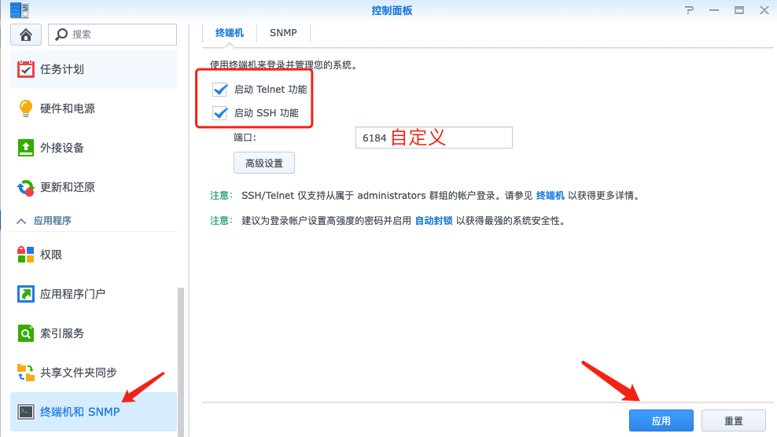
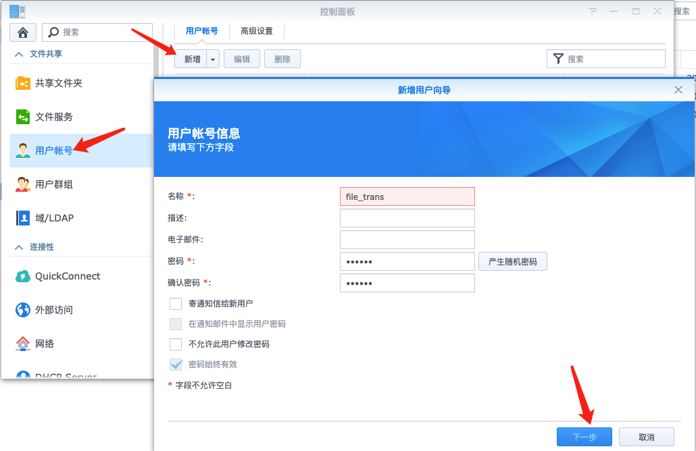
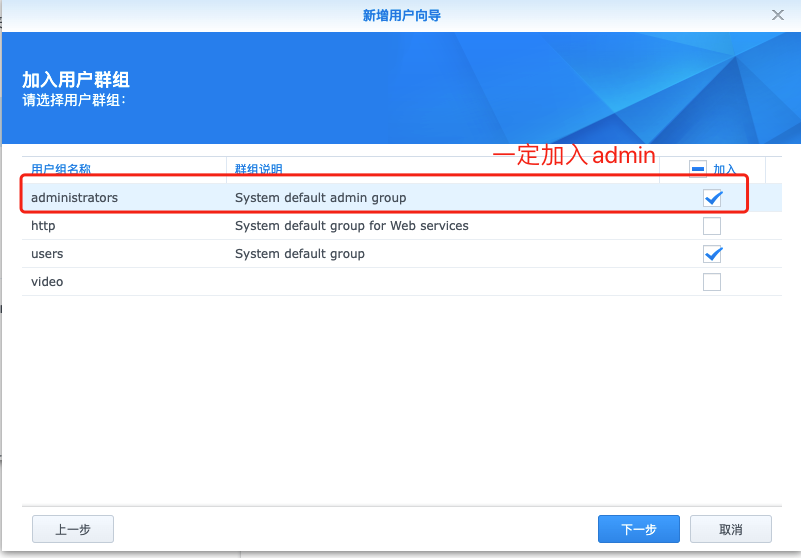
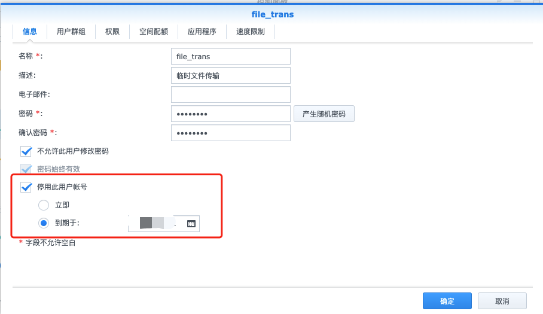
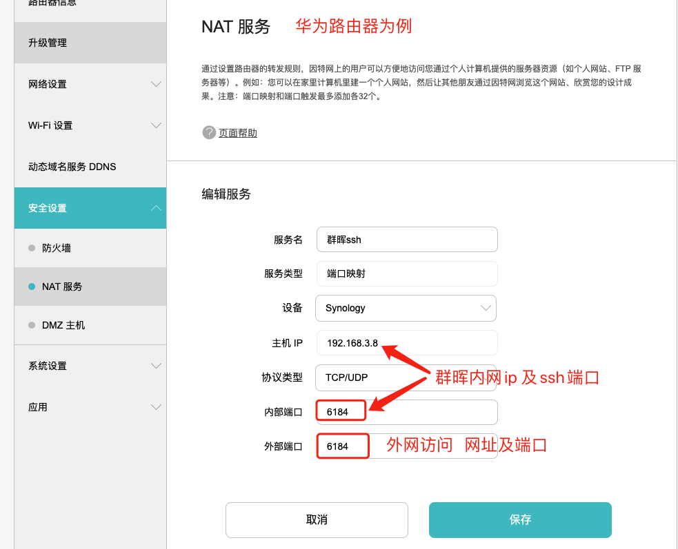

# 文件中转站

## 目的

群晖nas与服务器之间scp互传文件


## 流程

### 本地传输

1. 群晖开启SSH。端口自定义，以6184为例。

   

2. 创建 新账户，用于文件中转。

   




（可选）设定账户到期时间



3. 验证ssh连接、scp传输

   - ssh:  `ssh 用户名@群晖内网ip  -p 端口号`      例如 `ssh file_trans@192.168.X.X -p 6184`

   - scp

     ```shell
     # 服务器->群晖
     scp -P 远程端口  本地文件  用户名@群晖内网ip:远程文件夹路径
     例如scp -P 6184 ./out.log  file_trans@192.168.X.X:/home/downloads/
     ```

### 外网传输

> 假设内网的动态公网ip开启DDNS，绑定网址为abc.com

1. 路由器端口映射

   外网访问`abc.com 6184端口`时，路由器能映射到`群晖内网ip ssh端口6184`.

   

2. 验证ssh连接、scp传输

   将上述命令的`192.168.X.X`替换为`abc.com`即可。