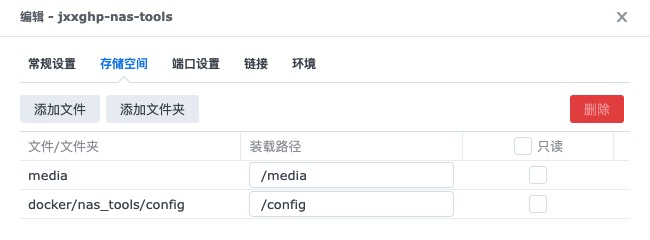
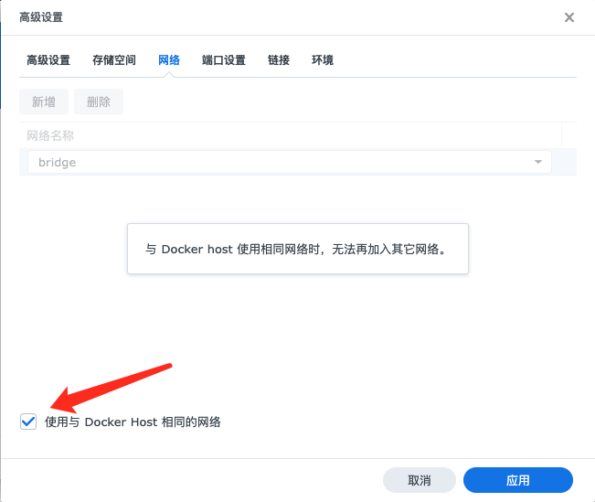
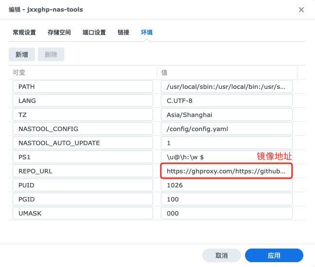
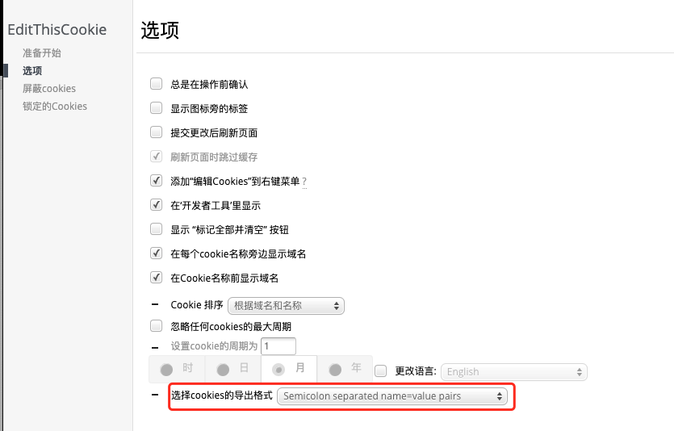
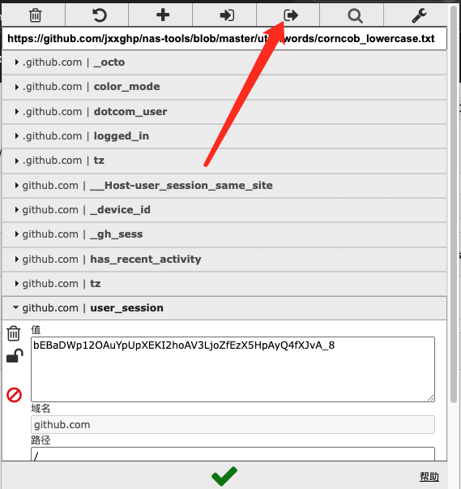

## 群晖Docker部署nas-tools

[安装教程](https://github.com/jxxghp/nas-tools/blob/master/docker/readme.md)

media文件夹设置访问权限








## 常见问题

1. 无法访问TMDB

   （1）docker启用Host网络

   （2）[修改群晖host文件，添加IP](https://post.smzdm.com/p/a83g3490/)

   ```bash
   // http://ping.chinaz.com/找延迟最低的IP
   api.themoviedb.org
   api.thetvdb.com		
   ```

2. PT站cookie

​    （1）chrome安装editthiscookie插件

​    （2）更改导出格式



​    （3）导出到粘贴板




