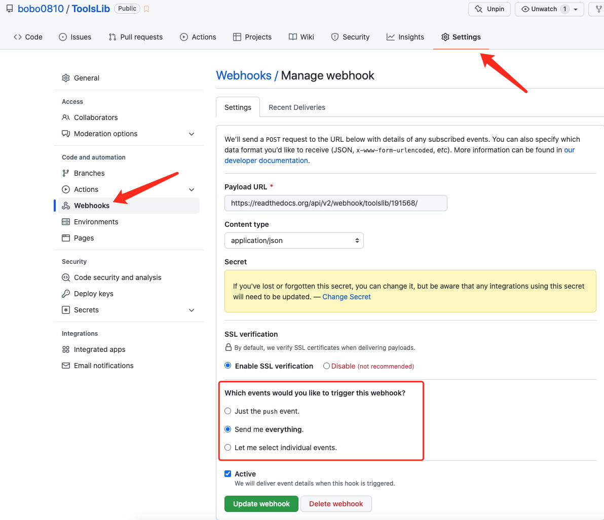

## ReadtheDocs托管文档

### 搭建

 [参考教程](https://www.xncoding.com/2017/01/22/fullstack/readthedoc.html)

### 注意

1. **配置步骤更改**

- 更改主题

  更改source/conf.py:

  ```python
  import sphinx_rtd_theme
  html_theme = 'sphinx_rtd_theme'
  ```

- 支持markdown

  ```python
  extensions = [
      'recommonmark', # markdown
      # 'sphinx_markdown_tables', # markdown表格，报错注销
  ]
  ```

2. **文档路径**

   readthedocs网站构建默认读取根目录doc或docs目录，故文档置于`根目录docs/`。参考[ToolsLib](https://github.com/bobo0810/ToolsLib)

3. **自动更新文档**

   webhooks自动触发文档更新

   


### 参考

[ReadtheDocs托管文档](https://www.xncoding.com/2017/01/22/fullstack/readthedoc.html)


