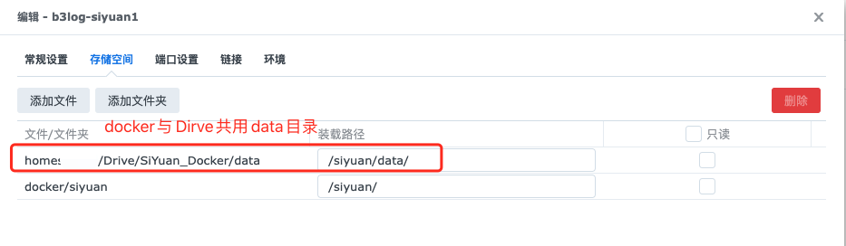
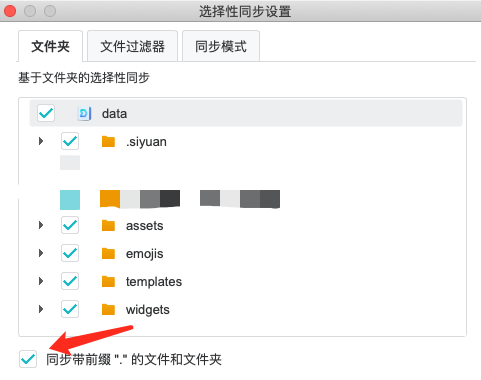

## 群晖Docker部署思源笔记

### 需求

本地笔记--Docker端笔记保持一致，实现多端访问。

### 问题

### 部署

[部署思源笔记](https://ld246.com/article/1628768198488)

注意：

（1）docker外的用户目录需设置**访问权限**。[方案1](https://wp.520810.xyz:666/?p=84)   [方案2](https://www.orcy.net.cn/1636.html)

（2）共用笔记目录data

### 问题

1. 若出现`未找到ID为[XXX]的内容块`。

> [重建索引](https://ld246.com/article/1632802461788/comment/1632806421257)即可。

2. 基于SynologyDrive，`本地笔记->Docker笔记同步`生效，但 `Docker笔记->本地笔记同步`不生效。

> 未解决，故Drive设置为单向同步。	

3. 同步内容

> 仅同步data文件夹，包含.文件
>
> 

