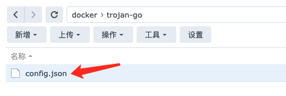
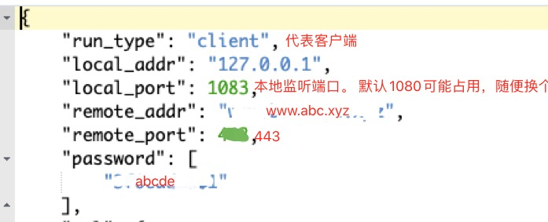
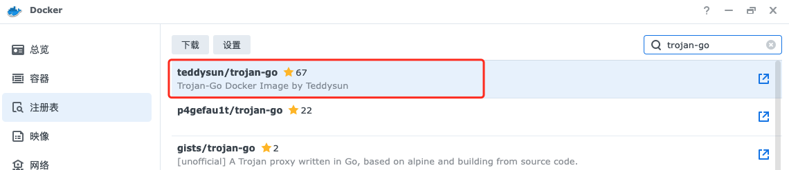
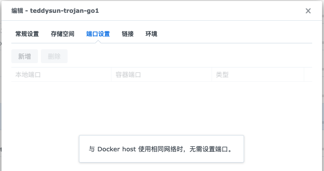
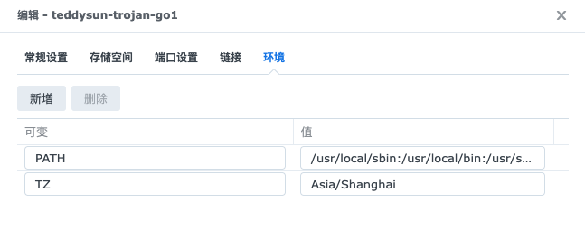
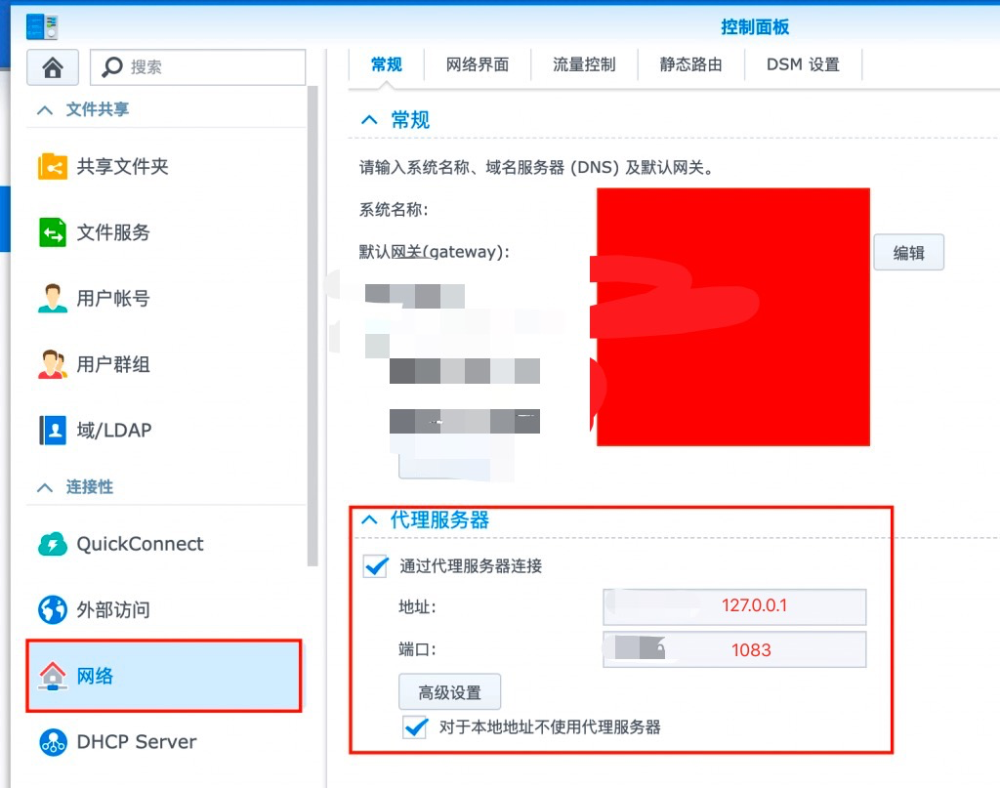
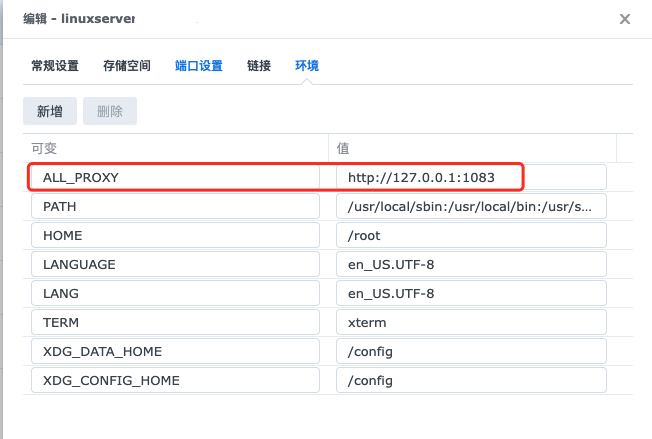

## NAS科学上网

适用场景：群晖等NAS、Linux系统等，操作均相同。

所需条件：Trojan-Go协议的科学上网账号

[Trojan-Go配置文档](https://p4gefau1t.github.io/trojan-go/basic/config/)

（1）搭建Trojan-Go客户端

- 假设已有Trojan-Go协议的科学上网账号：域名www.abc.xyz，端口443，密码abcde

[trojan-go库](https://github.com/p4gefau1t/trojan-go)下载`example/client.json`,重命名为`config.json`，上传到群晖并编辑。





> 注： 默认1080端口可能被占用，导致无法科学上网。

- 配置docker容器并启动，正常情况下，本地可通过`http://127.0.0.1:1083`进行科学上网。








（2）测试

命令行执行`curl -x http://127.0.0.1:1083  google.com`。若返回以下内容，则科学上网成功。

```bash
<HTML><HEAD><meta http-equiv="content-type" content="text/html;charset=utf-8">
<TITLE>301 Moved</TITLE></HEAD><BODY>
<H1>301 Moved</H1>
The document has moved
<A HREF="http://www.google.com/">here</A>.
</BODY></HTML>
```

（3）群晖系统科学上网

用途：Cloud Sync同步谷歌云等。



（4）群晖Docker科学上网

* 必须host网络
* 环境变量添加   ALL_PROXY      http://127.0.0.1:1083

  


