[TOC]

## 群晖设置导航页

[参考](https://post.smzdm.com/p/adwlg5rn/)

## 群晖Docker部署gogs

gogs：轻量级git服务器

1. 安装gogs

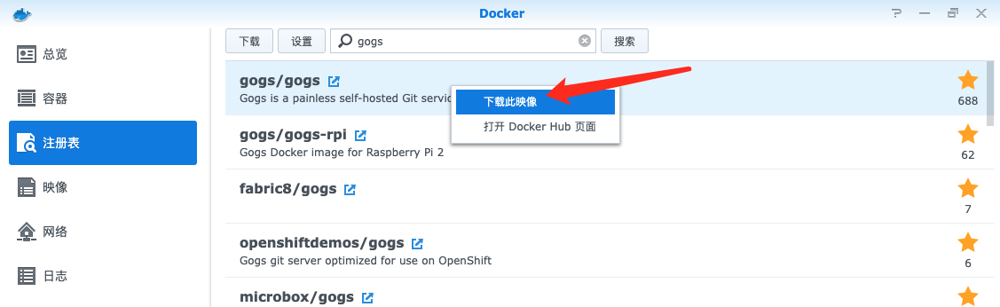

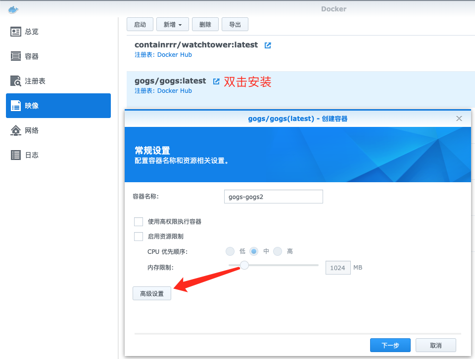

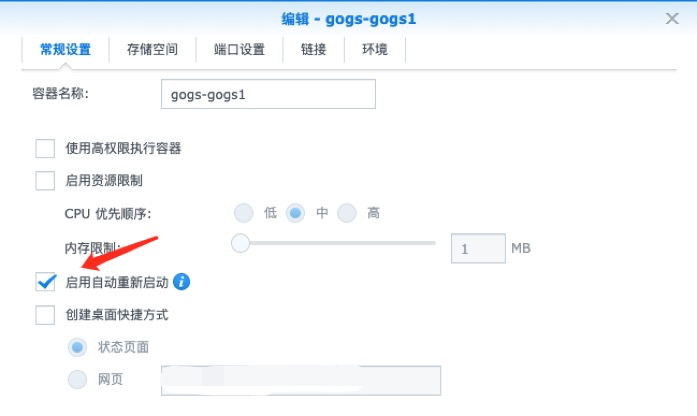

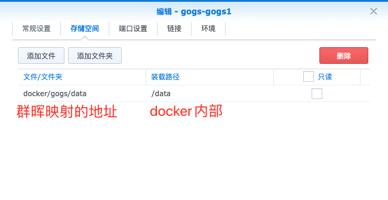

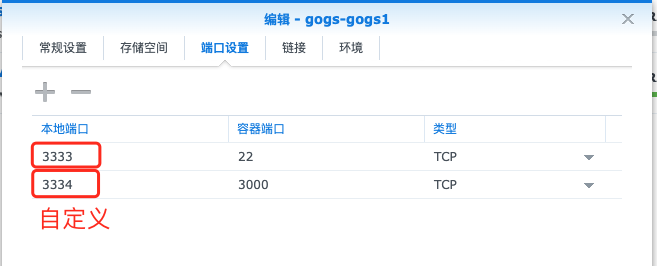

配置后启动容器

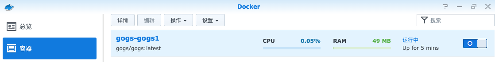

2. 初始化gogs配置

   设置参数后，点击**立即安装**

   访问安装地址 **群晖内网地址:http端口号**   eg: **192.168.3.8:3334**

   > 假设群晖有动态公网ip，绑定的外网可访问域名为**hahaha.familyds.com**

   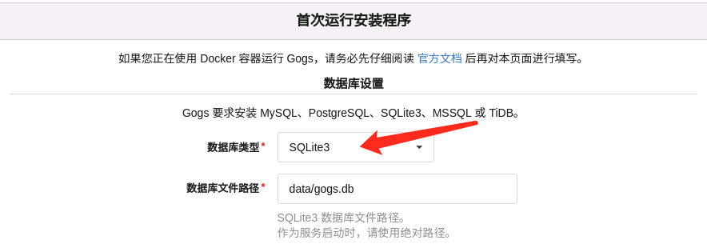

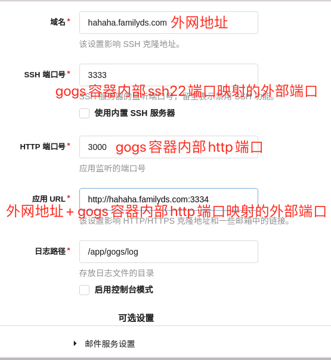

3. 外网访问

​	路由器放开http端口后，外网即可通过**http://hahaha.familyds.com:3334/**访问

   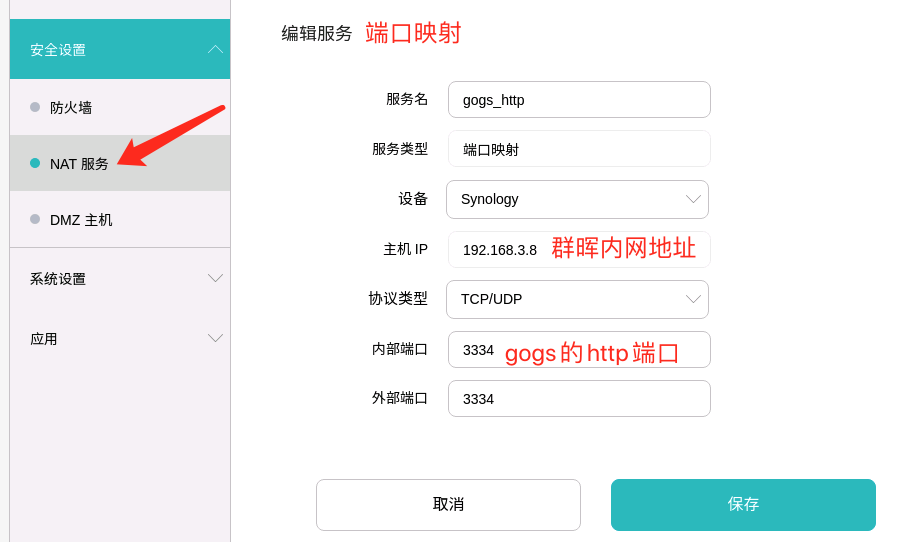

3. 外网测试

添加ssh公钥

> 查看命令  cat ~/.ssh/id_rsa.pub

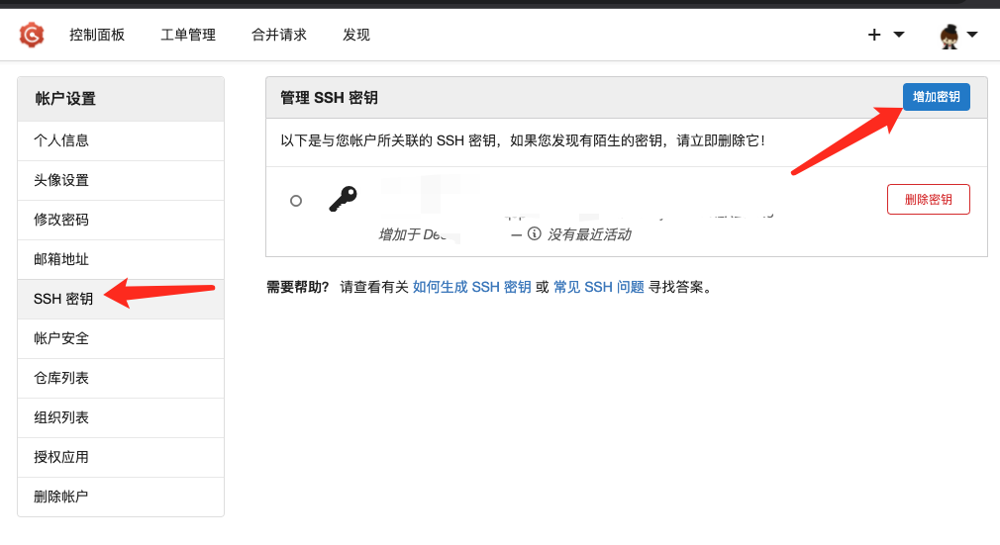

新建库并推送

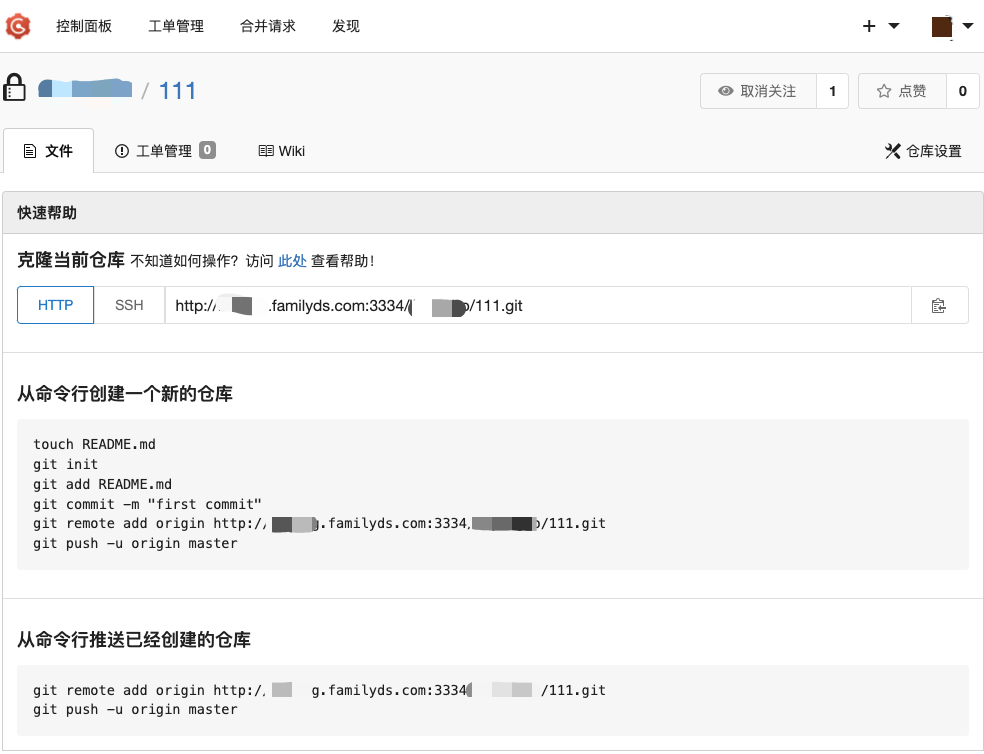

参考

[Docker-Ubuntu-Gogs部署及配置时遇到的问题](https://www.itfanr.cc/2017/03/24/docker-ubuntu-gogs-problems/)

[gogs官方库](https://github.com/gogs/gogs)

[群晖docker安装gogs及mysql进行代码管理](https://blog.csdn.net/hahofe/article/details/119106256)

